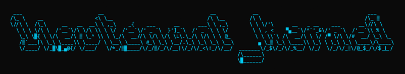

  

This Repository contains several low-level exploits and exercises in the field of client-side security. As of now, the following topics are covered:
- Buffer Overflows: Simple vulnerable code to test for buffer overflows in a coding environment or with debugging tools
- Reverse Shells
